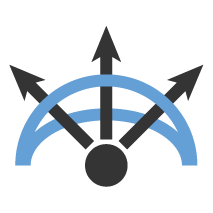

# Polarith AI Formation

[Polarith AI](https://polarith.com/ai/) offers all you need for achieving state-of-the-art movement
AI with just a few clicks. Design complex movement behaviours and create immersive games or
astonishing simulations by taking advantage of the sophisticated workflow.

This repository is an extension to Polarith AI which is entirely written in C# and supports all
Unity platforms, whereby Unity versions starting from 2018.4 up to 2020.3 are officially supported.

This package adds additional behaviours to enable placing agents in formations in 2D and 3D. You are
welcome to explore the code and to add additional formations. Feel free to create issues, add
branches, and create pull requests if you find a bug and want to provide a fix. Since the source
code is publicly available, there is only very *limited support*. The source code is available under
the MIT License. See the license file for more information.

Copyright © 2021 Polarith.

## Developers

+ Martin Zettwitz

## Dependencies

+ [Unity](https://unity3d.com/) | required: 2018.4.36+
+ [Polarith AI](https://assetstore.unity.com/publishers/23798) | required: 1.8+

## Project Structure

The code requires the Polarith DLL files that are available in the [Unity Asset
Store](https://assetstore.unity.com/publishers/23798). The folder structure of this repo is the same
as in the packages from the asset store. Simply add the DLLs in the /Assets/Polarith/AI/Plugins or
copy the whole repo to your project that contains Polarith AI. If copying manually, it is important
NOT TO OVERWRITE the existing files. Otherwise, the GUIDS mismatch. For convenience, you can use the
download script in /Polarith/AI/Extensions of the Pro and Free package. The `master` branch of this
repository represents the latest stable release of Polarith AI Formation.

The `develop` branch of this repository reflects the latest development work which is considered
stable enough to be prepared for the next release. Be warned, never use this branch in a production
environment. Feel free to branch from develop to add your own extensions or fixes to Polarith AI
Formation.

All other branches might contain highly experimental work which might be under heavy development at
the moment. Use at your own risk only.

## Source Code

The full source code of Polarith AI Formations lives within [`Assets/Sources`](Assets/Sources) and
[`Assets/Editor`](Assets/Editor). Just drop the sources directly into your Unity project but keep in
mind, you need either the DLLs of Polarith AI Free or Polarith AI Pro.

## Extension Scripts

The scripts in the Extension directory of the Unity Asset Store packages can easily download and
integrate the sources of the Polarith AI Formation extension into your project. For this to work
properly, your project needs to have Polarith AI installed with the default directory structure
(coming as it is from the Unity Asset Store).

In case you use a custom directory structure, you should not use these scripts. Instead, you can
integrate the sources yourself. Therefore, you can find the source code in this GitHub repository.

## Documentation

The online documentation of the latest stable release is available on https://docs.polarith.com/ai/.
The same documentation is bundled with the provided Unity package for offline use.

## Issue Tracker

The associated [issue tracker](https://github.com/Polarith/AI-Formation/issues) can be found within
the [public repository](https://github.com/Polarith/AI-Formation), which offers you the possibility
to discuss features, track bugs, and create pull requests for enhancements. With its help, you can
track our development progress.

## License

All parts of Polarith AI Formation are licensed under the [MIT License](LICENSE) which can be found
at the root of this repository.

The appropriate image material to comply with the license can be found under the
[`Images/`](Images/) directory.
